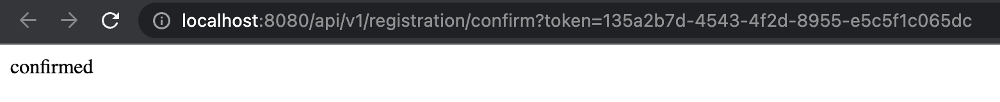

# LoginAndRegistrationService
Login and Registration Backend System using Spring Boot.


# Set up

#### If you wish to run the program do the following:

* Navigate to `com.example.demo.registration/DemoApplication.java`.
* Run the main method.

```java
package com.example.demo;

import org.springframework.boot.SpringApplication;
import org.springframework.boot.autoconfigure.SpringBootApplication;

@SpringBootApplication
public class DemoApplication {

	public static void main(String[] args) {
		SpringApplication.run(DemoApplication.class, args);
	}

}
```

# Registering User
<p align="center">
    
</p>


#### Database Lookup: Once registered 

* The user must confirm its email. Once User confirms `enabled` will turn true. Each User will also return a token in which it must be confirmed - it will be shown in the `confrimation_token` table as `confirmed_at`.
<p align="center">
    
</p>

* Check Package `com.example.demo.registration` for the Registration Service implementation.	


# Confirmation Email
* Used `Java Mail Sender` and `Java Mime Message` to send emails.
* Used [MailDev](https://github.com/maildev/maildev) to test email verifications.

<p align="center">
    
</p>
<p align="center">
    
</p>
<p align="center">
    
</p>


#### Sending Confirmation Email
* See `EmailService.java` for MailSender and Mime Message implementation and check `RegistrationService.java` for usage.
* Check `applications.yml` for configuration.
* See docs: [Link](https://www.jhipster.tech/tips/011_tip_configuring_email_in_jhipster.html)


#### Database Lookup: Once fully registered and confirmed.
<p align="center">
    
</p>

#### Logging In
<p align="center">
    
</p>

* Fully logged in. Error shows indication of no further mapping to the endpoint after logging in.


# Technologies
- Java
- SpringBoot/Spring JPA/Spring Security
- PostgreSQL
- Postman
- YAML